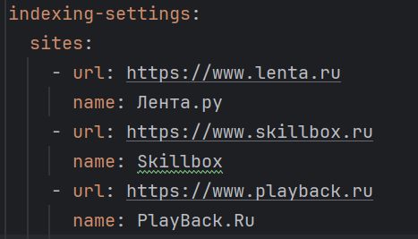
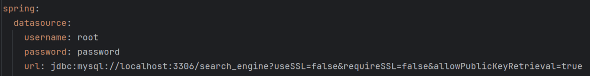
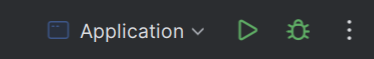
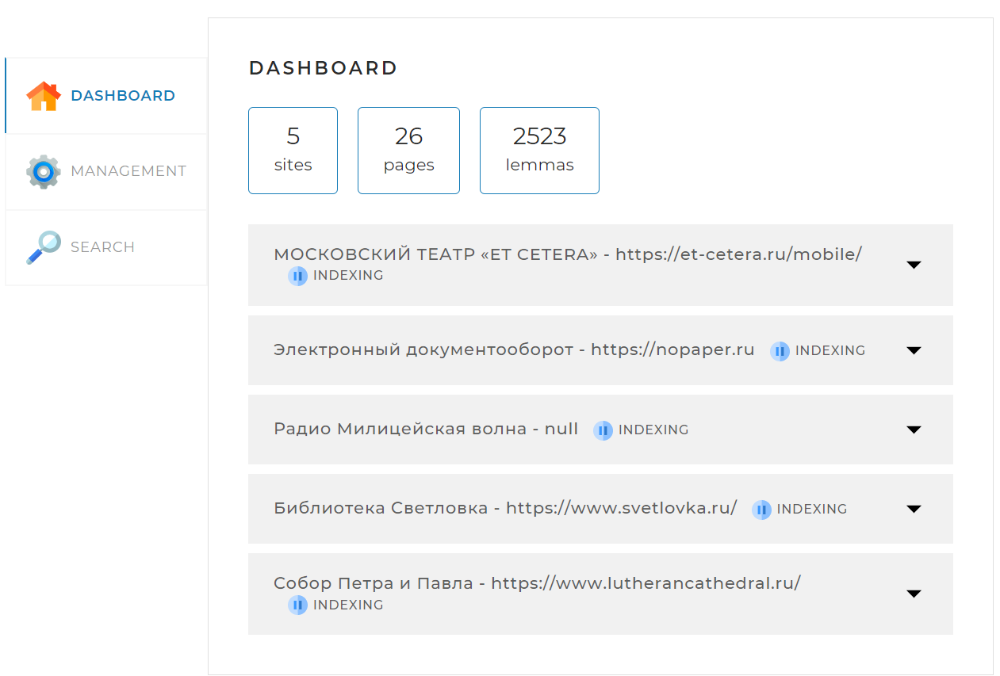
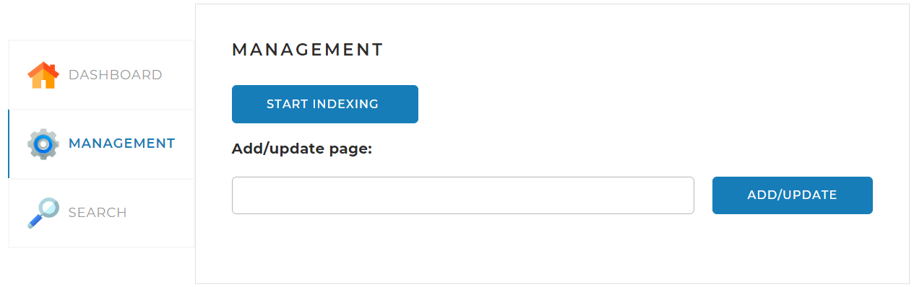
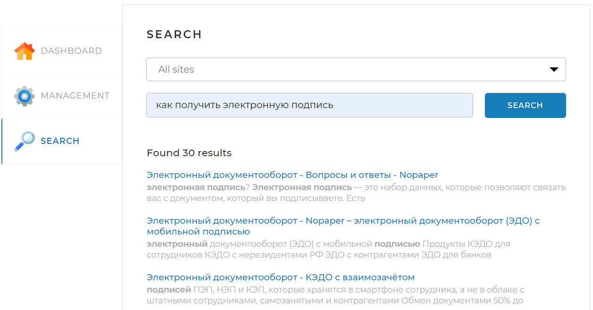

# SearchEngine

## Структура проекта

Веб приложение состоит из 2-х частей клиентской и серверной
Клиентская часть (frontend) представляет собой одну веб-страницу с тремя вкладками.
В серверной (backend) представляет собой MVC- приложение.

## Стек технологий
* Java 17
* Lombok
* Spring Boot 
* Hibernate
* Logback and slf4j  
* MySQL 8
* Lucene 
* Jsoup 

## Инструкция 
### Заполнение application.yaml
* Заполнить раздел с сайтами для индексации

* Заполнить поля для подключения к БД

### Запуск приложения

### Использование приложения
При локальном запуске приложения необходимо открыть в браузере страницу  http://localhost:8080
На странице находятся три вкладки

#### Dashboard
Dashboard. Эта вкладка открывается по умолчанию. На ней отображается общая статистика по всем сайтам, а также детальная статистика и статус по каждому из сайтов

#### Management
Management. На этой вкладке находятся инструменты управления поисковым движком — запуск и остановка полной индексации (переиндексации), а также возможность добавить (обновить) отдельную страницу по ссылке
* `START INDEXING` - запускает индексацию всех сайтов из `application.yaml`
* `STOP INDEXING` - останавливает индексацию всех сайтов
* `Add/update page` - запускает добавление, обновление индекса страницы сайта

#### Search. 
Эта вкладка предназначена для поиска. В поле 'Query' необходимо ввести запрос для поиска и нажать кнопку 'Search'

